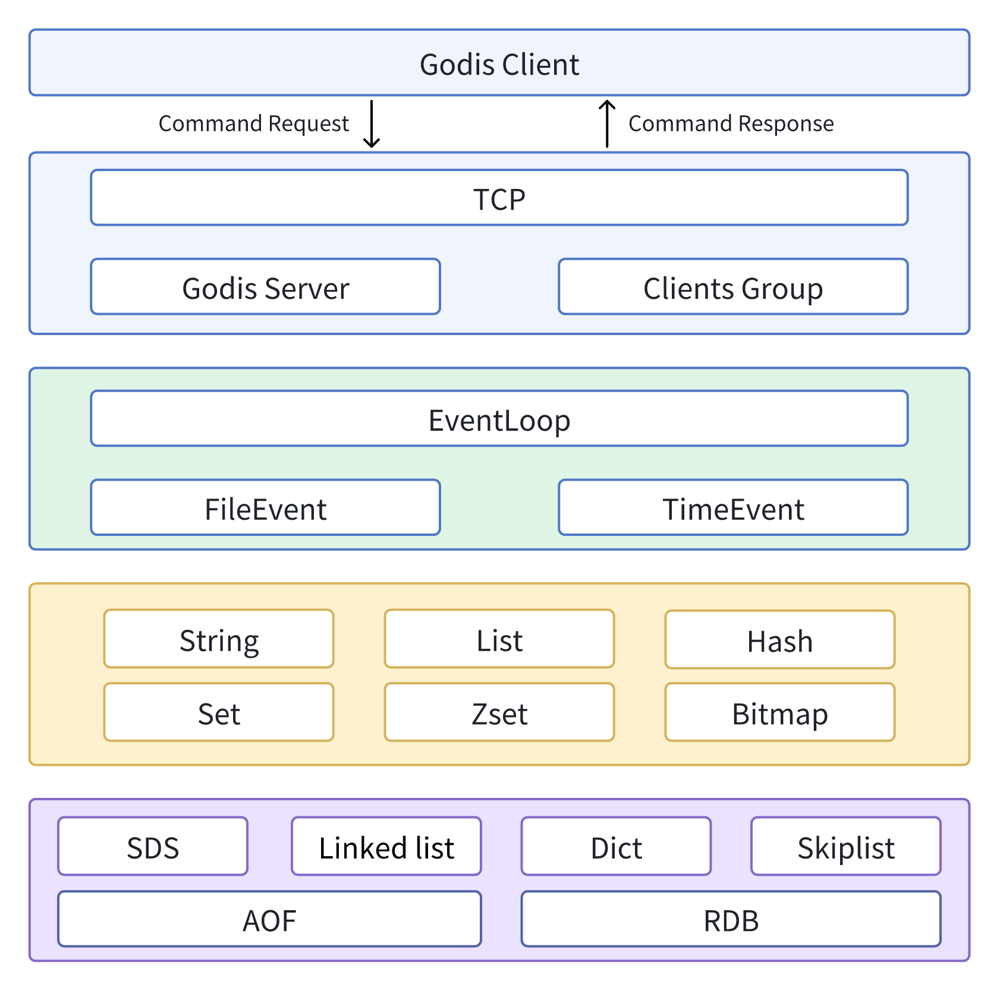

`Godis` is a golang implementation of Redis Server.

Key Features:

- Support string, list, hash, set, sorted set, bitmap
- TTL
- AOF and RDB
- RDB read and write


## Get Started

You can get runnable program in the releases of this repository, which supports Linux system.

```bash
go run main.go
```

You can connect to Godis through the Redis Client.
```bash
redis-cli -p 6767
```
